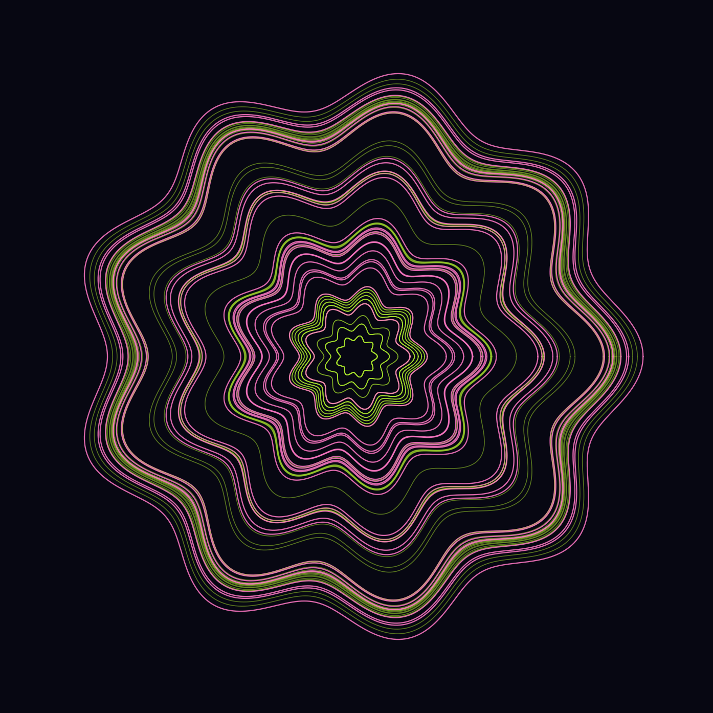
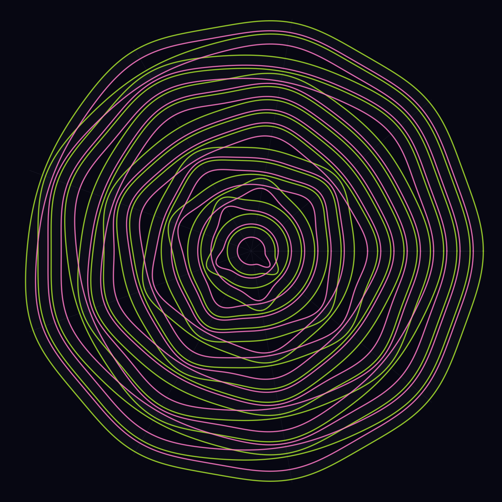

# LUCKY-LOTUS

Three polar-coordinate visualisations of the lucky locus, each
exploring a different conceptual angle of the same 96-cell phenomenon
(`LUCKY-LOCUS.md`). All three render as lotus flowers under the polar
wrap by construction — that is the unifying constraint. The three
angles are *what* is uniform, *why* it is uniform, and *where* in
parameter space the uniformity sits.

Generated by `lotus.py`. Source data: the 96 lucky cells in the
b = 10, n ∈ [2, 200], d ∈ [1, 7] sweep (69 Generalised Family E,
27 n²-cancellation).

---

## Lotus 1 — The Pond

**What it shows.** Every lucky cell rendered as a 9-fold rose curve
at radius `log10(q + 1)`, where `q` is the per-strip n-prime atom
count. Green curves are Generalised Family E cells (multiples of `n`
already uniform across strips); magenta curves are n²-cancellation
cells (multiples non-uniform, but n²-correction balances). The
9-fold ripple is `cos(9θ)` — the substrate's nine leading-digit
strips become nine lobes.

**Conceptual angle: the observable.** The lucky cells are defined
by uniform atom count across the nine leading-digit strips. The
9-fold rose curve *is* that uniformity, made visible: every lucky
cell, regardless of mechanism, gives a perfectly nonafold-symmetric
rose. The pond is what spread = 0 looks like at b = 10.

**What to read off.**

- Every ring is a single (n, d) cell. The 96 lucky cells form 96
  concentric ripples.
- Inner rings: small `q` (cells where the block contains few atoms,
  small d). Outer rings: large `q` (large d, larger blocks).
- Green and magenta interleave; both mechanisms produce the *same*
  visible signature — uniformity. The mechanism difference is
  invisible at the atom-count level. (That's the point of the next
  visual.)

---

## Lotus 2 — The Alignment

**What it shows.** Each ring is one of the 16 unique extras-patterns
observed across the 27 n²-cancellation cells. Two curves per ring:

- **Green** — the bumps trace `M_k(n)`'s extras (where the per-strip
  multiples-of-`n` count is `⌊W/n⌋ + 1` rather than `⌊W/n⌋`).
- **Magenta** — the bumps trace `M_k(n²)`'s extras.

Bumps are placed at the nine angular positions `θ_k = 2π(k − 1)/9`,
weighted by the extras vector. The faint radial spokes mark the
nine `θ_k` anchors.

**Conceptual angle: the mechanism.** Lotus 1 hides why the atom
count is uniform here — it just shows that it is. Lotus 2 lifts the
hood. The structural condition verified 27/27 in `analyze_lucky.py`
is that the `M_k(n)` and `M_k(n²)` extras patterns are bit-for-bit
identical. The visual proof: green and magenta bumps coincide at
the same `θ_k` on every ring. Where one bumps, the other bumps; the
difference (atoms) is constant.

**What to read off.**

- Every ring's green-magenta pair is *aligned* — bumps coincide.
  This is the alignment that produces atom-count uniformity despite
  non-uniform multiples-of-`n` counts.
- The patterns are diverse: some rings have alternating bumps (the
  Beatty-rich `010101010` shape), some have isolated singletons
  (`000000001`, `000001000`), some have dense arrays (`111011101`).
  This is what "27 cells, single mechanism, multiple realisations"
  looks like.
- The `M_k(n²)` bump amplitude visually matches `M_k(n)`'s — the
  relation is pattern-equality, not just equal differences.

---

## Lotus 3 — The Lattice

**What it shows.** The 69 Generalised Family E cells, organised by
`d`. Each `d`-class is a concentric ring (tier) of petals; petals
within a tier are evenly distributed angularly; petal length scales
with `log10(qp + 1)` normalised within the tier (so the d=7 tier
with `qp` up to 18868 doesn't dwarf the d=3 tier with `qp ∈ {1, 2, 3}`).
Tier colour by `d`:

- d = 3: lime
- d = 4: pale gold
- d = 5: amber
- d = 6: violet
- d = 7: rose

**Conceptual angle: the parameter space.** Lotus 1 and Lotus 2 sit
at the cell level. Lotus 3 zooms out to the family. The Generalised
Family E theorem closes the locus by `(qp, m_min)` parameters; cells
of the same `d` cluster into a tier, and within a tier each
`(qp, m_min)` group occupies an angular slot. The lotus is the
parameter-space layout of the closed-form theorem.

**What to read off.**

- The `d`-tier count (5) is the d-range across which Generalised
  Family E fires in the sweep (d = 3 through d = 7).
- Within each tier, petal count tracks the number of GFE cells at
  that `d`. Inner d=3 has 16 small petals; outer d=7 has the most
  variable lengths (huge `qp` range, from 13 to ~19000).
- Each petal is one `(d, qp, m_min)`-cell. The 46 unique
  `(d, qp, m_min)` groups in the sweep are visible as petal
  positions.
- The radial gap between tiers is just visual breathing room —
  there is no `d`-dependent quantity packed into it. The structure
  the lattice claims is the *angular* structure within each tier:
  ordered by `qp`, evenly spaced, all petals same shape, varying
  length.

---

## What the three together deliver

| visual | level | what is uniform | the polar payoff |
|---|---|---|---|
| Pond | cell | atoms per strip | rose: 9 leading digits = 9 lobes |
| Alignment | mechanism | extras patterns of `M_k(n)` and `M_k(n²)` | bump-pair coincidence |
| Lattice | parameter | `qp`-ordered cells within a `d`-tier | concentric rings of petals |

Lotus 1 says *that* the locus is symmetric. Lotus 2 says *why* the
n²-cancellation subset is symmetric despite non-uniform multiples.
Lotus 3 says *which* `(b, n, d)` the closed-form Generalised Family
E theorem covers, and how those cells stratify by `d`.

The three are conceptually independent — observable, mechanism,
parameter space — but the polar wrap collapses each onto a flower
shape, because each has either nine-fold structure (Pond, Alignment)
or a clean radial-tier decomposition (Lattice). The lotus theme is
not a forced fit; it is what the locus actually looks like when the
nine leading-digit strips become angular coordinates.

## Files

- `lotus.py` — generation script.
- `lotus_pond.png`, `lotus_alignment.png`, `lotus_lattice.png` —
  the three visuals.
- See also: `LUCKY-LOCUS.md` (the theorem and verification),
  `phase_diagram.png` (the rectilinear precursor).
